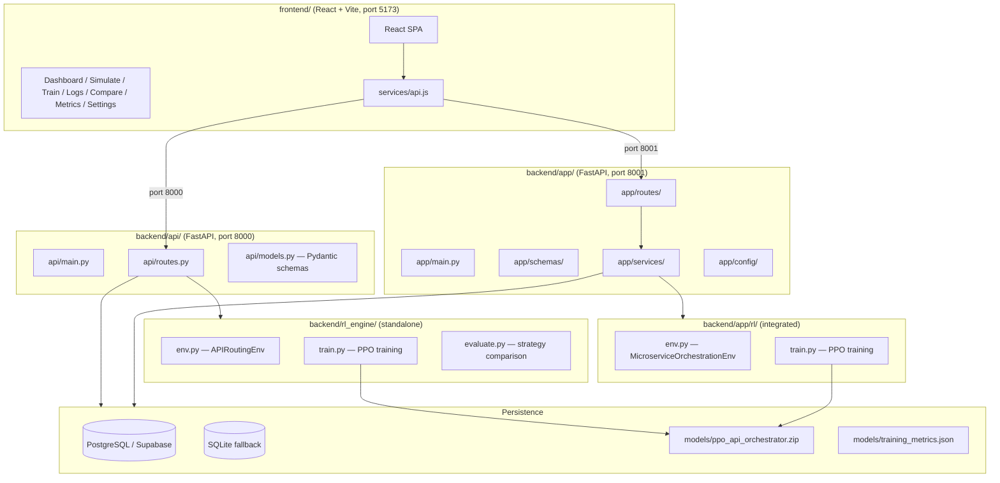

# Design: RL-Based Intelligent API Orchestration System

## Overview

The RL-Based Intelligent API Orchestration System is a full-stack application that uses a PPO (Proximal Policy Optimization) reinforcement learning agent to make intelligent API routing decisions. Given real-time system conditions (latency, cost, load, error rate, time-of-day), the agent selects the optimal provider from a discrete action space, balancing the competing objectives of low latency, low cost, and high reliability.

The system has two distinct backend applications that coexist:

- `backend/api/` — the primary production FastAPI app (port 8000), using `rl_engine/` for its RL environment and training
- `backend/app/` — a secondary FastAPI app (port 8001), using `app/rl/` for its own integrated RL environment

Both apps share the `backend/models/` directory for persisted PPO model artifacts. The React frontend (`frontend/`) communicates with both backends depending on the page context, defaulting to port 8000 for most routes.

---

## Architecture



### Key Architectural Decisions

**Dual-app split**: `api/` is the production-grade app with a clean separation between HTTP layer and RL engine. `app/` is the integrated app where the RL environment is tightly coupled to the service layer. Both exist to support different deployment and development workflows.

**Dual RL environment pattern**: `rl_engine/env.py` (`APIRoutingEnv`) uses a 6-dimensional state space with realistic time-of-day patterns and provider profiles. `app/rl/env.py` (`MicroserviceOrchestrationEnv`) uses a 5-dimensional state space with a simpler action semantics (call/retry/skip/switch). They are not interchangeable — each app uses its own environment.

**Graceful DB degradation**: Both apps detect DB availability at startup and fall back to in-memory storage, ensuring the system runs without a configured database.

---

## Components and Interfaces

### backend/api/ — Primary App

#### `api/main.py`
FastAPI application with lifespan context manager. Handles startup (DB init, model preload) and shutdown. Registers the single `router` from `api/routes.py`. CORS origins are configurable via `CORS_ORIGINS` env var.

#### `api/routes.py`
All route handlers in a single `APIRouter`. Lazy-loads the PPO model and environment on first use. Falls back to in-memory lists when DB is unavailable.

| Method | Path | Description |
|--------|------|-------------|
| GET | `/` | Health check — returns model_loaded status |
| POST | `/simulate-api` | Single routing decision with RL agent |
| POST | `/simulate-run` | Multi-step simulation episode |
| GET | `/get-decision` | Query-param based routing decision |
| POST | `/train` | Trigger PPO training (blocking) |
| GET | `/training-metrics` | Read `training_metrics.json` |
| GET | `/evaluation-results` | RL vs static strategy comparison |
| GET | `/api-logs` | Paginated API log fetch |
| GET | `/rl-decisions` | Recent RL decision records |
| GET | `/dashboard-stats` | Aggregated dashboard statistics |
| POST | `/evaluate` | Run multi-episode evaluation |

#### `api/models.py`
Pydantic v2 request/response schemas:
- `SimulateAPIRequest` — 6 normalized floats (latency, cost, success_rate, request_load, time_of_day, error_rate)
- `TrainRequest` — timesteps + learning_rate
- `DecisionResponse` — action, provider info, reward, state, timestamp
- `SimulationResponse` — per-step routing result
- `SimulationRunResponse` — list of steps + episode summary
- `TrainingStatusResponse`, `HealthResponse`, `MetricsResponse`, `DashboardStats`

---

### backend/app/ — Secondary App

#### `app/main.py`
FastAPI application on port 8001. Registers three route groups: `api_routes`, `rl_routes`, `ui_routes`.

#### `app/routes/`
Three route modules:
- `api_routes.py` — API simulation endpoints using `APISimulator`
- `rl_routes.py` — RL decision and execution endpoints using `RLAgent`
- `ui_routes.py` — Dashboard data aggregation endpoints

#### `app/services/rl_agent.py` — `RLAgent`
```python
ACTION_MAP = {0: "call API", 1: "retry", 2: "skip", 3: "switch API"}

class RLAgent:
    model: PPO | None
    def load_model(self) -> None
    def get_action(self, state_array: list[float]) -> int
    def get_action_with_confidence(self, state_array: list[float]) -> tuple[int, float]
```
Lazy-loads the PPO model from `settings.RL_MODEL_PATH`. Falls back to random action when model is absent. Confidence scoring uses the policy's action probability distribution.

#### `app/services/api_simulator.py` — `APISimulator`
Static class with `API_ECOSYSTEM` dict covering 5 categories (ecommerce, user, logistics, financial, external). `call_api(category, api_name, system_load, is_retry)` returns `{api_name, latency, cost, success}`. Load factor scales latency; retry multiplies cost by 1.5 and boosts success probability by 0.05.

#### `app/services/db_service.py`
Synchronous SQLAlchemy ORM operations: `insert_api_log`, `insert_rl_decision`, `insert_training_metrics`, `fetch_logs`.

#### `app/config/database.py`
SQLAlchemy engine + `SessionLocal` factory. `get_db()` yields a session for FastAPI dependency injection. Detects SQLite vs PostgreSQL from `DATABASE_URL` and sets `check_same_thread` accordingly.

#### `app/config/settings.py`
`Settings` class reading from `.env`. Key fields: `DATABASE_URL`, `PROJECT_NAME`, `RL_MODEL_PATH`.

---

### backend/rl_engine/ — Standalone RL Engine

#### `rl_engine/env.py` — `APIRoutingEnv`

**State space** (6-dim, all in [0,1]):
```
[0] current_latency   — normalized API latency
[1] current_cost      — normalized API cost
[2] success_rate      — recent success ratio
[3] request_load      — current request volume
[4] time_of_day       — normalized hour (0-1)
[5] error_rate        — recent error ratio
```

**Action space**: `Discrete(4)`
```
0 — Provider A (Fast, Expensive):   latency [0.05, 0.25], cost [0.6, 0.9], success 0.95
1 — Provider B (Balanced):          latency [0.2, 0.5],  cost [0.3, 0.6], success 0.90
2 — Provider C (Cheap, Slow):       latency [0.4, 0.8],  cost [0.05, 0.3], success 0.85
3 — Fallback/Cache:                 latency [0.01, 0.05], cost [0.0, 0.05], success 0.70
```

**Reward function**:
```
reward = w_latency*(1-latency) + w_cost*(1-cost) + w_success*success - penalty*(1-success)
where: w_latency=0.3, w_cost=0.3, w_success=0.4, penalty=1.0
```

**Episode**: max 200 steps, `truncated=True` at limit, `terminated=False` (no terminal state).

#### `rl_engine/train.py`
`train_model(total_timesteps, save_dir, model_name, learning_rate, n_steps, batch_size, n_epochs, gamma)` — creates `APIRoutingEnv`, instantiates `PPO("MlpPolicy", ...)`, attaches `TrainingMetricsCallback`, calls `model.learn()`, saves to `{save_dir}/{model_name}.zip`. Metrics written to `{save_dir}/training_metrics.json`.

#### `rl_engine/evaluate.py`
`evaluate_model(model_path, n_episodes, save_dir)` — runs 6 strategies (PPO Agent, Random, Always-A, Always-B, Always-C, Round-Robin) for `n_episodes` each, computes avg reward/latency/cost/success_rate, saves JSON + matplotlib comparison chart.

---

### backend/app/rl/ — Integrated RL

#### `app/rl/env.py` — `MicroserviceOrchestrationEnv`

**State space** (5-dim):
```
[0] latency          — normalized [0,1]
[1] cost             — normalized [0,1]
[2] success_rate     — rolling EMA [0,1]
[3] system_load      — [0,3]
[4] previous_action  — action/3 normalized [0,1]
```

**Action space**: `Discrete(4)` — call(0), retry(1), skip(2), switch(3)

**Reward**: success → `100 - lat_norm*10 - cost*5`; failure → `-50 - lat_norm*10 - cost*5`; skip → `-10`

Registered as `MicroserviceOrchestrator-v0`.

#### `app/rl/train.py`
`train_rl_agent(timesteps)` — trains on `MicroserviceOrchestrationEnv`, saves to `settings.RL_MODEL_PATH`.

---

### backend/db/ — Legacy DB Layer

`db/connection.py` — raw `psycopg2` connection pool with context manager. Provides `insert_api_log`, `get_api_logs`, `insert_rl_decision`, `get_rl_decisions`, `insert_training_run`, `complete_training_run`, `insert_evaluation_result`, `get_evaluation_results`, `get_dashboard_stats`. Used exclusively by `api/routes.py`.

`db/schema.sql` — DDL for `api_logs`, `rl_decisions`, `training_runs`, `evaluation_results` tables.

---

### frontend/ — React Dashboard

**Stack**: React 18, Vite, React Router v6, Recharts, Axios, Lucide React.

**Pages**:
| Route | Component | Backend Calls |
|-------|-----------|---------------|
| `/` | Dashboard | `getDashboardStats`, `getTrainingMetrics`, `getRLDecisions` |
| `/simulate` | Simulate | `POST /rl/execute` (port 8001) |
| `/logs` | Logs | `getAPILogs`, `getRLDecisions` |
| `/compare` | Compare | `getEvaluationResults`, `POST /evaluate` |
| `/metrics` | Metrics | `getTrainingMetrics` |
| `/train` | Train | `POST /train` |
| `/settings` | Settings | — |

**`frontend/src/services/api.js`**: Axios instance with `VITE_API_BASE_URL` base (default `http://localhost:8000`). Exports typed functions for all backend endpoints.

**State management**: Local `useState` per page. No global store — each page fetches its own data on mount.

---

## Data Models

### Database Tables (PostgreSQL / SQLite)

#### `api_logs`
```sql
id          SERIAL PRIMARY KEY
timestamp   TIMESTAMPTZ DEFAULT NOW()
action      INTEGER          -- 0-3
provider    TEXT
latency     FLOAT            -- normalized [0,1]
cost        FLOAT            -- normalized [0,1]
success     BOOLEAN
reward      FLOAT
state       JSONB            -- 6-element float array
```

#### `rl_decisions`
```sql
id                  SERIAL PRIMARY KEY
timestamp           TIMESTAMPTZ DEFAULT NOW()
episode             INTEGER
step                INTEGER
state_latency       FLOAT
state_cost          FLOAT
state_success       FLOAT
state_load          FLOAT
state_time          FLOAT
state_error         FLOAT
action              INTEGER
provider            TEXT
result_latency      FLOAT
result_cost         FLOAT
result_success      BOOLEAN
reward              FLOAT
cumulative_reward   FLOAT
```

#### `training_runs`
```sql
id                  SERIAL PRIMARY KEY
timestamp           TIMESTAMPTZ DEFAULT NOW()
completed_at        TIMESTAMPTZ
total_timesteps     INTEGER
learning_rate       FLOAT
final_avg_reward    FLOAT
final_success_rate  FLOAT
model_path          TEXT
status              TEXT    -- 'running' | 'completed' | 'failed'
```

#### `evaluation_results`
```sql
id                  SERIAL PRIMARY KEY
timestamp           TIMESTAMPTZ DEFAULT NOW()
strategy            TEXT
avg_episode_reward  FLOAT
avg_latency         FLOAT
avg_cost            FLOAT
success_rate        FLOAT
num_episodes        INTEGER
```

### SQLAlchemy ORM Models (`app/models/db_models.py`)

`APILog`, `RLDecision`, `TrainingMetrics`, `TrainingRun`, `EvaluationResult` — mirror the schema above using `declarative_base`. Auto-created via `Base.metadata.create_all(bind=engine)` on import.

### Pydantic Schemas

**Request schemas** (`app/schemas/request_schema.py`):
```python
class RLStateInput(BaseModel):
    latency: float          # [0,1]
    cost: float             # [0,1]
    success_rate: float     # [0,1]
    system_load: float      # [0,3]
    previous_action: int    # {0,1,2,3}

class APIRequest(BaseModel):
    api_category: str
    api_name: str
    system_load: float

class ExecuteRequest(BaseModel):
    state: RLStateInput
    api_category: str
    api_name: str
```

**Response schemas** (`app/schemas/response_schema.py`):
```python
class RLDecisionResponse(BaseModel):
    action: int
    action_name: str

class ExecuteResponse(BaseModel):
    action: int
    action_name: str
    api_response: dict
    reward: float
```

### Training Metrics File (`models/training_metrics.json`)
```json
{
  "timestamps": ["ISO8601..."],
  "timesteps": [1000, 2000, ...],
  "mean_rewards": [0.42, ...],
  "mean_latencies": [0.31, ...],
  "mean_costs": [0.28, ...],
  "success_rates": [0.87, ...]
}
```

---

## Correctness Properties

*A property is a characteristic or behavior that should hold true across all valid executions of a system — essentially, a formal statement about what the system should do. Properties serve as the bridge between human-readable specifications and machine-verifiable correctness guarantees.*

### Property 1: RL Agent Action Validity

*For any* state vector with all components in their valid ranges, the RL agent SHALL return an action in {0, 1, 2, 3} and a confidence score in [0.0, 1.0].

**Validates: Requirements 1.1, 1.3**

---

### Property 2: Reward Formula Correctness

*For any* triple (latency, cost, success) where latency ∈ [0,1], cost ∈ [0,1], success ∈ {True, False}, the reward function SHALL compute exactly:
`reward = 0.3*(1-latency) + 0.3*(1-cost) + 0.4*float(success) - 1.0*float(not success)`

**Validates: Requirements 2.1**

---

### Property 3: Reward Sign on Failure

*For any* latency ∈ [0,1] and cost ∈ [0,1], when success=False, the reward SHALL be strictly negative (since the failure penalty 1.0 exceeds the maximum possible positive contribution of 0.6).

**Validates: Requirements 2.3**

---

### Property 4: Reward Monotonicity with Latency

*For any* fixed cost ∈ [0,1] and fixed success ∈ {True, False}, if latency_a < latency_b then reward(latency_a, cost, success) > reward(latency_b, cost, success).

**Validates: Requirements 2.4**

---

### Property 5: API Simulator Response Structure

*For any* (category, api_name) pair — whether valid or invalid — `APISimulator.call_api` SHALL return a dict containing exactly the keys: `api_name`, `latency`, `cost`, `success`. For invalid inputs, `success` SHALL be False and an `error` key SHALL be present.

**Validates: Requirements 3.1, 3.4**

---

### Property 6: Retry Cost Multiplier

*For any* valid (category, api_name) pair, calling `APISimulator.call_api` with `is_retry=True` SHALL return a cost equal to exactly 1.5× the base cost for that API.

**Validates: Requirements 3.3**

---

### Property 7: DB Persistence Round-Trip

*For any* API log record (api_name, latency, cost, success), inserting it and then fetching logs SHALL return a result set that contains a record matching the inserted values.

**Validates: Requirements 4.1**

---

### Property 8: Fetch Limit and Ordering Invariants

*For any* integer N ≥ 1 and any number of records in the database, `fetch_logs(limit=N)` SHALL return at most N records, and the returned records SHALL be ordered by timestamp descending (newest first).

**Validates: Requirements 4.2, 4.3**

---

### Property 9: Observation Space Invariant

*For any* sequence of valid actions applied to a freshly reset `APIRoutingEnv`, every observation returned by `reset()` and `step()` SHALL have all 6 components within [0.0, 1.0].

**Validates: Requirements 5.1, 5.2**

---

### Property 10: Simulate-API Response Structure

*For any* valid `SimulateAPIRequest` (all fields in their declared ranges), `POST /simulate-api` SHALL return a response containing: `action` (int in 0-3), `provider` (str), `latency` (float), `cost` (float), `success` (bool), `reward` (float).

**Validates: Requirements 6.1**

---

## Error Handling

### Model Not Loaded
Both `api/routes.py` and `app/services/rl_agent.py` handle the absent-model case:
- `api/routes.py`: raises `HTTPException(503)` with a message directing the user to `POST /train`
- `RLAgent.get_action()`: falls back to `random.randint(0, 3)` and logs a warning

### Database Unavailable
`api/routes.py` wraps the DB import in a try/except at module load time. `DB_AVAILABLE` flag gates all DB calls; in-memory lists (`_in_memory_logs`, `_in_memory_decisions`) serve as fallback. `app/services/db_service.py` propagates SQLAlchemy exceptions to the route layer, which should catch and return 500.

### Invalid API Simulator Inputs
`APISimulator.call_api` returns `{"api_name": name, "latency": 0, "cost": 0, "success": False, "error": "API not found"}` for unknown category/api_name combinations. No exception is raised.

### Training Failures
`POST /train` wraps `do_train()` in a try/except and returns `HTTPException(500, detail=str(e))` on failure.

### State Vector Out of Range
The RL environment's `observation_space` uses `np.clip` internally when generating next states, preventing out-of-bounds observations. The `RLAgent` does not validate input state vectors — callers are responsible for normalization.

### CORS
`api/main.py` reads `CORS_ORIGINS` from env (default: `http://localhost:5173`). `app/main.py` uses `allow_origins=["*"]` — this should be restricted in production.

---

## Testing Strategy

### Dual Testing Approach

Both unit tests and property-based tests are required. Unit tests verify specific examples, integration points, and error conditions. Property tests verify universal correctness across randomized inputs.

### Property-Based Testing

**Library**: `hypothesis` (Python) for backend properties; `fast-check` (npm) for frontend properties.

**Configuration**: Each property test runs a minimum of 100 examples (`@settings(max_examples=100)`).

**Tag format**: Each test is annotated with:
```python
# Feature: rl-api-orchestration, Property N: <property_text>
```

**Property test implementations**:

```python
# Property 1: RL Agent Action Validity
# Feature: rl-api-orchestration, Property 1: For any valid state, action in {0..3} and confidence in [0,1]
@given(
    st.lists(st.floats(0.0, 1.0), min_size=6, max_size=6)
)
@settings(max_examples=100)
def test_rl_agent_action_validity(state):
    agent = RLAgent()
    action, confidence = agent.get_action_with_confidence(state)
    assert action in {0, 1, 2, 3}
    assert 0.0 <= confidence <= 1.0

# Property 2: Reward Formula Correctness
# Feature: rl-api-orchestration, Property 2: reward = exact formula
@given(
    latency=st.floats(0.0, 1.0),
    cost=st.floats(0.0, 1.0),
    success=st.booleans()
)
@settings(max_examples=100)
def test_reward_formula(latency, cost, success):
    env = APIRoutingEnv()
    reward = env._calculate_reward(latency, cost, success)
    expected = 0.3*(1-latency) + 0.3*(1-cost) + 0.4*float(success) - 1.0*float(not success)
    assert abs(reward - expected) < 1e-9

# Property 3: Reward Sign on Failure
# Feature: rl-api-orchestration, Property 3: failure reward is always negative
@given(latency=st.floats(0.0, 1.0), cost=st.floats(0.0, 1.0))
@settings(max_examples=100)
def test_reward_negative_on_failure(latency, cost):
    env = APIRoutingEnv()
    reward = env._calculate_reward(latency, cost, success=False)
    assert reward < 0

# Property 4: Reward Monotonicity
# Feature: rl-api-orchestration, Property 4: lower latency → higher reward
@given(
    lat_a=st.floats(0.0, 0.99),
    delta=st.floats(0.001, 1.0),
    cost=st.floats(0.0, 1.0),
    success=st.booleans()
)
@settings(max_examples=100)
def test_reward_monotone_latency(lat_a, delta, cost, success):
    assume(lat_a + delta <= 1.0)
    env = APIRoutingEnv()
    r_low = env._calculate_reward(lat_a, cost, success)
    r_high = env._calculate_reward(lat_a + delta, cost, success)
    assert r_low > r_high

# Property 5: API Simulator Response Structure
# Feature: rl-api-orchestration, Property 5: response always has required keys
@given(
    category=st.sampled_from(list(API_ECOSYSTEM.keys())),
    api_name=st.text(min_size=1, max_size=20),
    load=st.floats(0.5, 3.0)
)
@settings(max_examples=100)
def test_simulator_response_structure(category, api_name, load):
    result = APISimulator.call_api(category, api_name, load)
    assert {"api_name", "latency", "cost", "success"}.issubset(result.keys())

# Property 7: DB Persistence Round-Trip
# Feature: rl-api-orchestration, Property 7: insert then fetch returns the record
@given(
    api_name=st.text(min_size=1, max_size=50),
    latency=st.floats(0.0, 1.0),
    cost=st.floats(0.0, 1.0),
    success=st.booleans()
)
@settings(max_examples=100)
def test_db_round_trip(api_name, latency, cost, success):
    db = TestingSessionLocal()
    log = insert_api_log(db, api_name, latency, cost, success)
    logs = fetch_logs(db, limit=1)
    assert logs[0].api_name == api_name
    db.close()

# Property 9: Observation Space Invariant
# Feature: rl-api-orchestration, Property 9: all observations in [0,1]
@given(actions=st.lists(st.integers(0, 3), min_size=1, max_size=50))
@settings(max_examples=100)
def test_observation_bounds(actions):
    env = APIRoutingEnv()
    obs, _ = env.reset()
    assert np.all(obs >= 0.0) and np.all(obs <= 1.0)
    for action in actions:
        obs, _, terminated, truncated, _ = env.step(action)
        assert np.all(obs >= 0.0) and np.all(obs <= 1.0)
        if terminated or truncated:
            break
```

### Unit Tests

Unit tests focus on specific examples, edge cases, and integration points. Avoid duplicating what property tests already cover.

**`tests/test_rl_agent.py`**:
- Example: `RLAgent` with no model file returns a valid action (0-3) via random fallback
- Example: `RLAgent` loaded with a trained model returns deterministic action for fixed state

**`tests/test_api_simulator.py`**:
- Example: `call_api("ecommerce", "payment_A", 1.0)` returns success with probability ~0.95
- Example: `call_api("invalid", "invalid")` returns `success=False` with `error` key
- Example: retry cost = 1.5× base cost for `payment_A`
- Edge case: `system_load=3.0` degrades success probability

**`tests/test_db_service.py`**:
- Example: insert + fetch round-trip with SQLite in-memory DB
- Example: `fetch_logs(limit=5)` returns ≤ 5 records
- Example: records returned newest-first

**`tests/test_rl_env.py`**:
- Example: `env.reset()` returns 6-dim observation
- Example: after `max_steps` steps, `truncated=True`
- Example: `get_episode_summary()` returns correct keys after episode

**`tests/test_routes.py`** (integration, using `httpx.AsyncClient`):
- Example: `GET /` returns `{"status": "healthy", ...}`
- Example: `POST /simulate-api` with valid body returns all required fields
- Example: `POST /simulate-api` without trained model returns 503
- Example: `GET /api-logs?limit=10` returns list of ≤ 10 items

**`tests/frontend/`** (Vitest + React Testing Library):
- Example: `<Dashboard />` renders without crashing when API returns empty data
- Example: `<Simulate />` displays provider badge after successful simulation response

### Test Configuration

```toml
# pyproject.toml
[tool.pytest.ini_options]
testpaths = ["backend/tests"]
asyncio_mode = "auto"

[tool.hypothesis]
max_examples = 100
deriving = "auto"
```

```json
// frontend/package.json (test script)
"test": "vitest --run"
```
